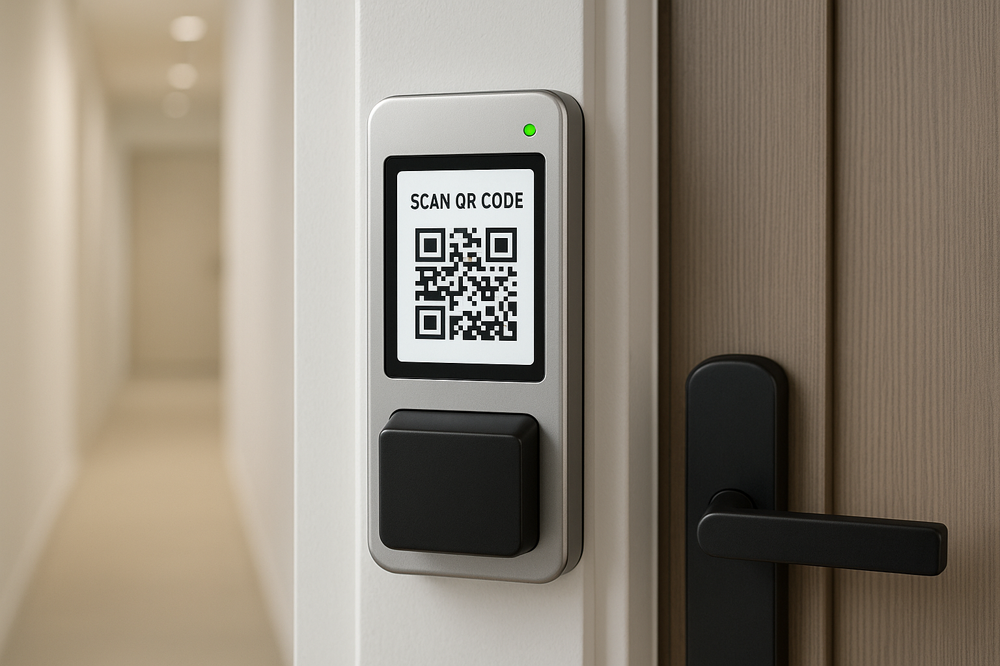
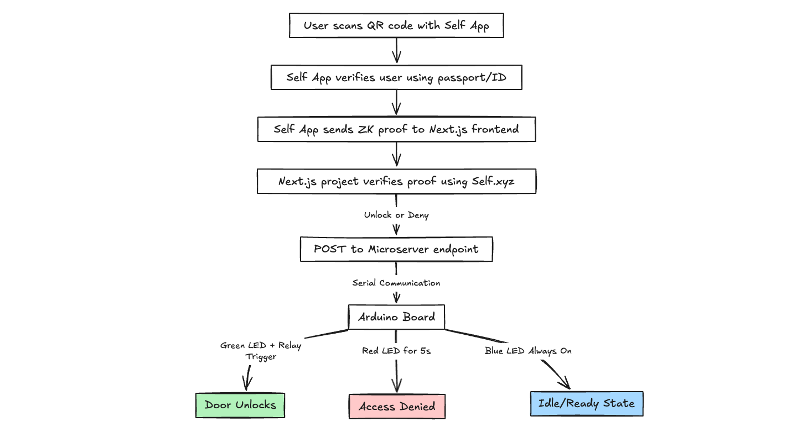

# Self-Checkin 🔐🚪



Self-Checkin is a privacy-preserving, IoT-enabled access control system that uses [Self.xyz](https://self.xyz) zero-knowledge proofs to verify a user's identity or attributes (like age or nationality) before granting physical access via a connected Arduino-controlled lock system.

---

## 📁 Repository Structure

```
self-checkin/
├── client-app/          # Next.js project for QR display and Self.xyz verification
├── serial-server/       # Microserver that bridges HTTP requests to Arduino via serial
└── arduino-code/        # Arduino sketch for LED and relay control
```

---

## 🔧 How It Works

1. **User scans a QR code** (generated by the Next.js app) with the Self.xyz mobile app.
2. **Self App verifies ID** and generates a zero-knowledge proof (ZKP).
3. The proof is sent to the **Next.js app**, which verifies it using Self’s backend SDK.
4. Upon successful verification, a request is sent to the **Serial Server**, which relays it via serial communication to the Arduino.
5. The **Arduino board**:

   - Shows a **blue LED** (idle/ready)
   - **Green LED** & relay (unlock) on success
   - **Red LED** on failure (resets to blue after 5 seconds)

---

## 🧱 System Architecture Diagram



## 🔁 Sequence Diagram

## 

## 📲 Use Cases

### 🏨 Airbnb or Hotel Room Check-in

Guests verify their ID via Self.xyz and unlock their reserved unit.

### 🛒 Age-Gated Vending Machines

Dispense alcohol, tobacco, or medication only after Self verification proves age eligibility.

### 🧳 Smart Lockers

Secure storage access in gyms, coworking spaces, or airports for verified users.

### 🏢 Coworking Access Control

Restrict entrance to verified members only, enforcing proof of membership or identity.

### 🎓 University Dorm Access

Let only verified students (by age or enrollment status) unlock specific doors.

### 🧪 Laboratory & Restricted Area Entry

Use Self-verified credentials to enforce access to sensitive locations.

### 🎤 Event Check-In / Badge Pickup

Verify users and automatically unlock badge printers or entry gates.

### 🏥 Medical Dispensers / Clinic Entry

Verify identity and age before allowing access to prescription dispensers or private rooms.

### 🧑‍⚖️ Secure Voting Kiosks

Allow only real, verified individuals to access digital voting terminals.

---

## ⚙️ Setup Instructions

### 1. `nextjs-app`

- Displays QR code
- Verifies ZK proofs with Self.xyz

```bash
cd nextjs-app
npm install
npm run dev
```

> 📌 _Configure Self scope and backend endpoint in `.env` file._

### 2. `serial-server`

- Express/Node server that listens for POST requests and sends serial commands to Arduino

```bash
cd serial-server
npm install
node index.js
```

> 📌 _Update `SERIAL_PORT` and `BAUD_RATE` in the config._

### 3. `arduino-code`

- Upload this sketch to an Arduino (Uno, ESP32, etc.)
- Handles green, red, and blue LEDs and relay logic

```cpp
// Use Arduino IDE or PlatformIO to upload
```

> 📌 _Wiring diagram goes here (LEDs and relay connected to digital pins)_

---

## 🧪 Test Scenario

1. Start `nextjs-app` and open the page with the QR code.
2. Scan QR with Self.xyz mobile app.
3. Complete verification using a passport or national ID.
4. Based on result:

   - Green LED + Unlock
   - Red LED for 5 sec
   - Return to Blue

---

## 📋 Future Enhancements

- NFC tag replacement for QR
- On-device QR generation using e-paper
- Raspberry Pi version with camera support
- Offline verification cache
- Mobile fallback via Bluetooth

---

## 🤝 Contributing

Open-source contributions are welcome! Please fork and PR or open an issue for discussion.

---

## 📜 License

MIT License © 2025 Zerovoid

---

## 🧠 Credits

Developed with love by the Zerovoid team.
Uses:

- [Self.xyz](https://self.xyz)
- [Next.js](https://nextjs.org)
- [Arduino](https://www.arduino.cc)
- [Node.js](https://nodejs.org)

---

> ✨ _Join the privacy-first access control movement and let people prove who they are — without giving away who they are._
